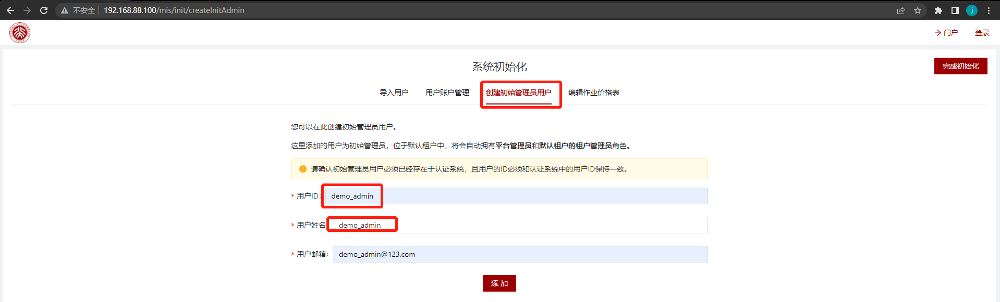

# scow-vagrant：slurm+SCOW集群一键部署

[TOC]

本项目面向<font color='red' size=5>**开发**</font>和<font color='red' size=5>**测试**</font>人员，基于Vagrant，采用VirtualBox作为Provider，提供slurm+SCOW集群一键部署方案，极大简化了部署流程和部署门槛。部署slurm+SCOW四节点集群，节点角色及默认配置如下表所示：

| 节点名称/角色 |                           主要服务                           |     私网IP     | 配置 |
| :-----------: | :----------------------------------------------------------: | :------------: | :--: |
|     slurm     | slurmdbd、slurmctld、slurmd、mariadb、nfs-server、slapd、sssd | 192.168.88.101 | 2C4G |
|     login     |         slurmd、sssd、nfs、Xfce、KDE、MATE、cinnamon         | 192.168.88.102 | 2C4G |
|     cn01      |         slurmd、sssd、nfs、Xfce、KDE、MATE、cinnamon         | 192.168.88.103 | 4C4G |
|     scow      |         scow：portal、mis、auth、gateway、export job         | 192.168.88.100 | 4C8G |


## 1. 使用

### 1.1 集群一键部署命令

```shell
vagrant up
```


> 第一次部署需要从vagrant clould拉取vagrant镜像，速度会比较慢，请耐心等待。

### 1.2 集群初始化

> 初始化地址：http://192.168.88.100/mis/init/  用户名/密码：demo_admin/demo_admin

进入初始化页面，选择创建初始管理员用户，将`demo_admin`设置为管理员用户。后续用户、账户设置请参考本项目操作手册。



### 1.3 SCOW镜像更新

由于SCOW的docker镜像是在构建Vagrant镜像时刻的master分支版本，若需最新功能，请更新SCOW最新镜像。

```shell
#登录到集群scow节点
vagrant  ssh scow

# 切换root用户，密码为：vagrant
su root 

# 进入scow部署目录
/root/scow/scow-deployment

# 拉取最新镜像
./compose.sh pull

# 重启服务
./compose.sh down
./compose.sh up -d
```

### 1.4 集群一键销毁命令

```shell
vagrant  destroy
```

## 2. 如何修改节点私网IP


## 3. 如何新增计算节点


## 4 .Vagrant环境搭建